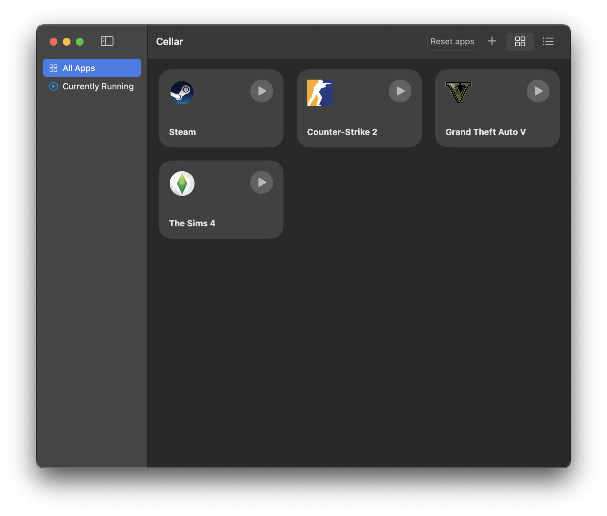

# Cellar

A macOS app that manages your Windows apps and games with Wine.
Currently only supporting macOS Sonoma, as it is required by Apple's Game Porting Toolkit.

## Preview

## Features
- GUI wrapper for Wine
- Wine process manager
- Run custom commands
- Easily configurable custom launch arguments and wine configurations (coming soon...)
- Desktop & Dock shortcuts for easy access (coming soon...)

## Requirements
- macOS Sonoma or later
- [Game Porting Toolkit](https://developer.apple.com/games/)

## Installation of Game Porting Toolkit

Game Porting Toolkit (GPTK) is a translation layer for Windows' DirectX 12 games into Apple's Metal framework. You will need to install GPTK for gaming support.

Note: You will also need an Apple ID to download GPTK

### Instructions
- Go to https://developer.apple.com/download/all/?q=game%20porting%20toolkit and sign in with your Apple ID.
- Download the latest version of GPTK
- Once downloaded, open the downloaded .dmg and follow the instructions outlined in `README.md`

---

Made by [dcas796](https://dcas796.github.com/)
